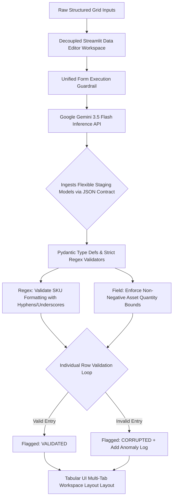

# Project 3: AI Autonomous ETL Agent (Corporate Schema Validation Mapping Tool)

This enterprise portfolio application leverages generative artificial intelligence and programmatic validation layers to automate Extract, Transform, and Load (ETL) routines on fragmented vendor data streams. It maps unstructured spreadsheet cells directly into validated enterprise relational models using Pydantic runtime enforcement.

## System Workflow Architecture

## System Workflow Step-by-Step Execution

1. **Ingestion & Grid Segregation:** Structured column data is ingested cleanly inside an interactive spreadsheet workspace decoupled from standard layout locks to maintain memory states during user interactions.
2. **Generative Schema Resolution:** The tabular payload is flattened into a data text stream and routed to Gemini 3.5 Flash using a strict raw validation template constraint to discover schema alignments dynamically.
3. **Programmatic Strict Validation:** The resulting structural JSON output maps into an intermediate staging tier before passing individual lines into custom type-guard boundary filters.
4. **Error Interception Loop:** An isolated row-level transaction handler captures validation exceptions on individual row segments to mark entries as either VALIDATED or CORRUPTED without dropping complete execution streams.
5. **Relational Output Mapping:** Clean records, schema operational log files, and detailed data anomaly ledgers render dynamically inside a clean, modern multi-tab monitoring interface equipped with custom CSV data exporter components.
