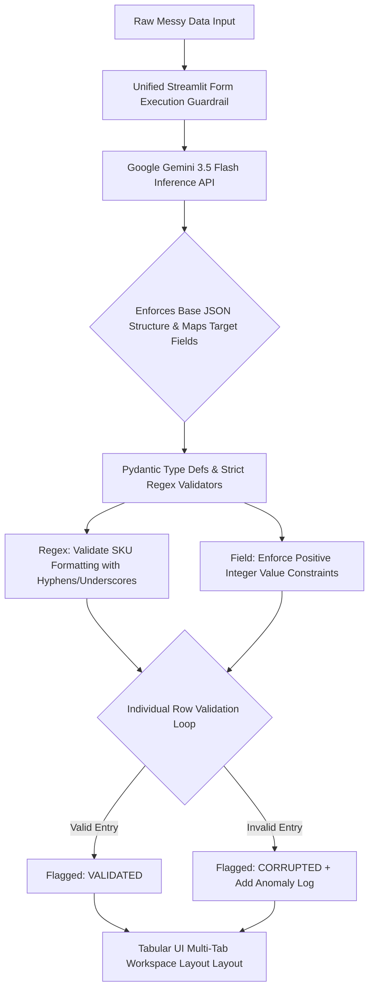

# Project 3: AI Autonomous ETL Agent (Corporate Schema Validation Mapping Tool)

This enterprise portfolio application leverages generative artificial intelligence and programmatic validation layers to automate Extract, Transform, and Load (ETL) routines on fragmented vendor data streams. It maps unstructured schemas directly into validated enterprise relational models using Pydantic runtime enforcement.

## System Workflow Architecture

## System Workflow Step-by-Step Execution

1. **Ingestion & Guardrails:** Unstructured, variably delimited data is ingested safely inside an isolated Streamlit form block to throttle unnecessary system processing and optimize resource usage.
2. **Generative Layout Resolution:** The data payload is routed to Gemini 3.5 Flash with instructions and an engineering schema template constraint to discover schema alignments.
3. **Programmatic Strict Validation:** The resulting structural JSON output passes into a layered validator block where custom field rules execute formatting matching patterns and bounding restrictions.
4. **Error Interception Loop:** An isolated validation handler captures validation exceptions on individual row segments to mark entries as either VALIDATED or CORRUPTED without dropping complete execution streams.
5. **Relational Output Mapping:** Clean records, schema operational adjustments logs, and detailed structural system anomaly ledgers render dynamically inside a multi-tab tabular workspace layout.
